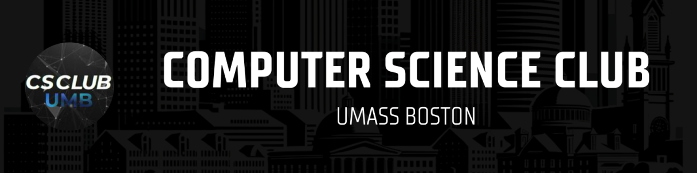

# UMass Boston Computer Science Club

Welcome to the UMass Boston Computer Science Club! We are a vibrant community of students passionate about technology, coding, and collaboration. Our club is dedicated to providing a supportive environment where Computer Science students can come together to learn, share knowledge,work on exciting projects, and hear from professionals in the tech industry.

## What We Do

- **LeetCode Sessions**: We host sessions where members can work together on LeetCode problems, improve their coding skills, and prepare for technical interviews.
- **Knowledge Sharing**: Our meetings are a way for members to share their insights, experiences, and tips related to computer science, programming, and technology trends.
- **Guest Speakers**: We invite professionals from the tech industry, including leading companies like Microsoft, Google, and Amazon, to share their experiences, provide industry insights, and offer career advice.
- **Hackathons**: We organize hackathons where members can team up, brainstorm ideas, and develop innovative solutions to real-world problems.
- **Resume Roasts**: We host resume roasting sessions where members can get constructive feedback on their resumes from peers and industry professionals, helping them improve their job application prospects.
- **Networking**: Our club is a great place for Computer Science students to meet like-minded individuals, collaborate on projects, and build lasting connections.

## Membership

Membership is open to all UMass Boston students with an interest in computer science, regardless of their major. There are no membership fees, and members can participate in as many or as few activities as they like.

## Meetings

Meeting dates, times, frequency, and locations are announced via our discord server!

## Stay Connected

- **Instagram**: [@umb_csc](https://www.instagram.com/umb_csc/)
- **Discord**: [UMB Computer Science Club](https://discord.gg/wtE5FpeezZ)
- **LinkedIn**: [UMass Boston Computer Science Club](https://www.linkedin.com/company/umass-boston-computer-science-club/)

## Join Us

If you're a UMass Boston student interested in computer science, coding, and technology, we'd love to have you join our club! To become a member, simply attend one of our meetings or reach out to us via email or social media.

Let's code, collaborate, and create together!